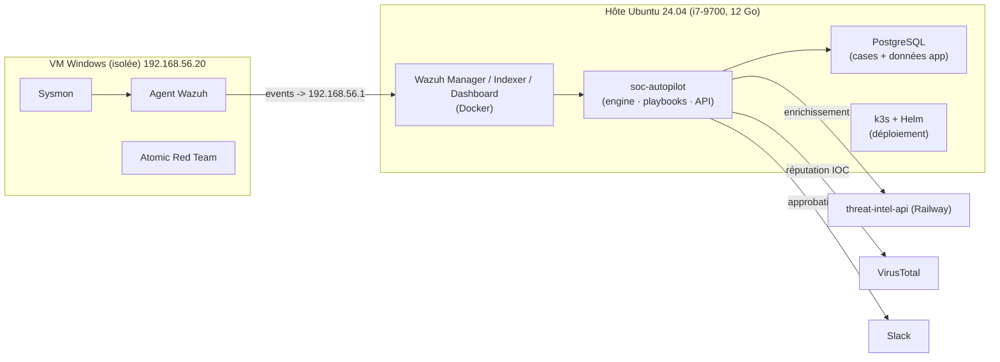

# soc-autopilot

**SOAR de détection-as-code** : un pipeline qui reçoit une alerte Wazuh, l'enrichit
(threat intel sectorielle + VirusTotal), ouvre un cas, demande une approbation Slack,
puis exécute une action de réponse (ex. isolation d'hôte) — le tout versionné,
testé et déployé comme du code.

> Labo personnel de detection engineering. Documentation complète dans [`docs/`](docs/).

---

## Architecture (Voie B — SIEM sur l'hôte)

Ce labo tourne sur une machine à **~12 Go de RAM**. L'architecture « 3 machines »
classique (VM SIEM 8 Go + VM victime 4 Go) n'y tient pas. Choix retenu et **assumé** :

- Le **SIEM (Wazuh)** et **PostgreSQL** tournent **directement sur l'hôte en conteneurs** —
  on supprime la VM `soc-lab`.
- Une **VM Windows isolée** reste la **cible** (Sysmon + agent Wazuh + Atomic Red Team).
- **TheHive** est remplacé par une **table `cases` dans PostgreSQL**, derrière une
  interface `CaseBackend` (rebasculable via une variable d'env).



**Pourquoi ce choix (et pas juste « suivre le tuto ») :** l'isolation compte pour ce qui
*exécute* le code offensif — la **victime** — pas pour le collecteur qui l'observe.
Wazuh en conteneurs est déjà isolé (process, FS, teardown en une commande), et en prod
un SIEM serait de toute façon sur son propre hôte dédié, pas dans une VM desktop.
L'arbitrage est né d'une contrainte RAM réelle, et il est documenté — pas caché.

Plan d'adressage : hôte host-only `192.168.56.1` · VM Windows `192.168.56.20`.

---

## Démarrage rapide

```bash
export SOC_DIR="/media/mdoub/Data/Personal Projects/soc-autopilot"
cd "$SOC_DIR"

# 1. Environnement Python (venv hors NTFS)
source ~/.venvs/soc-autopilot/bin/activate

# 2. Secrets
cp .env.example .env            # puis remplir les `changeme`

# 3. PostgreSQL (backend des cas)
cd infra/soc-stack && docker compose up -d && cd -

# 4. Wazuh (voir infra/wazuh/README.md — clone + tuning RAM)
```

**Usage en 2 phases** (contrainte RAM — jamais tout à la fois) :
| Session | Ce qui tourne | ~RAM |
|---|---|---|
| **Détection** | Wazuh + Postgres + **VM Windows** | ~9-10 Go |
| **Déploiement / SOAR** | Wazuh + Postgres + **k3s** + app | ~7 Go |

---

## Structure du dépôt

```
soc_autopilot/   engine, actions, api, models — le cœur applicatif
playbooks/       playbooks SOAR (YAML)
detections/      règles Sigma (windows/ + linux/)
tests/           unit / integration / fixtures
charts/          chart Helm de déploiement
infra/           soc-stack (compose Postgres) + wazuh (notes de lancement)
.github/         workflows CI/CD (lint, SAST, SCA, IaC, signature d'image)
docs/            documentation détaillée (01 → 05)
```

## Sécurité du pipeline (shift-left)

`ruff` · `bandit` (SAST) · `mypy` · `pip-audit` (SCA) · `checkov` (IaC) · `trivy`
(conteneurs + IaC) · `hadolint` · `kubeconform` · `detect-secrets` + `pre-commit`
(anti-secret) · `cosign` (signature d'image keyless). `sigma-cli` traduit les règles
Sigma vers OpenSearch/Elasticsearch/Splunk.
